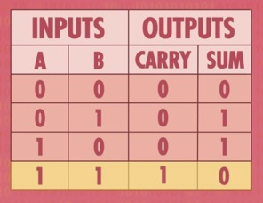
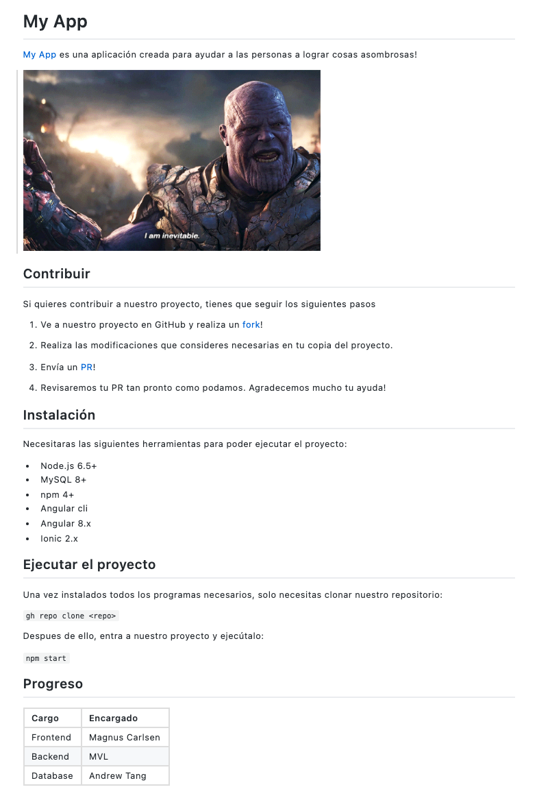

# PC1 (20 puntos)

Duración: 120 minutos

## Compuertas Lógicas

En el laboratorio 2 del curso, aprendimos que la computadora utiliza transistores para almacenar los datos sobre los cuales opera. Esta utiliza los operadores lógicos AND, OR y NOT para poder realizar otras operaciones booleanas o aritméticas.

Un ejemplo de un operador matemático es el operador de suma el cual recibe dos números a operar y devuelve el resultado.

El operador `medio sumador` realiza la operación de suma pero de sólo dos bits. Devolviendo un bit de acarreo y un bit de suma. Su tabla de verdad puede ser apreciada a continuación:



Donde SUM es la Suma de ambos bits, y CARRY es el acarreo de la suma.

Implemente el operador `medio sumador` utilizando [la herramienta online](https://academo.org/demos/logic-gate-simulator/) usada en el laboratorio y únicamente los operadores AND, OR y NOT. Suba una imagen llamada `pregunta1.png` del circuito creado.

La operación `medio sumador` esta representada por la siguiente ecuación:


## Operaciones con bits en Python

En el laboratorio 3, aprendimos algunos operadores a nivel de bits de python. Entre ellos, los operadores:
- `&`: realiza bit a bit la operación AND en los operandos.
- `|`: realiza bit a bit la operación OR en los operandos.
- `^`: realiza bit a bit la operación XOR en los operandos.
- `~`: realiza bit a bit la operación NOT, invirtiendo cada bit en el operando.


Tiene un programa en python llamado `numero_unico`. El cual recibe 7 números, todos los números están repetidos una vez. Sólo uno de ellos no está repetido.

Se le pide modificar la función número único de tal manera que guarde en la variable `respuesta` el número que no está repetido.

Restricción: Sólo puede utilizar los operadores mencionados. En otras palabras, solo puede utilizar `&`, `|`, `^`, `~`.

Tiene permitido utilizar `=` para asignar el resultado a la variable `resultado`.

```python
def numero_unico(num1, num2, num3, num4, num5, num6, num7):

  # realice aquí sus operaciones
  # respuesta = ...?
  
  print(respuesta)
```

Ejemplo 1:

Invocar la función con los siguiente valores:

```python
numero_unico(4, 7, 15, 7, 4, 15, 9)
```
Retornará:
```
Output:
9
```

Ejemplo 2:

Invocar la función con los siguiente valores:

```python
numero_unico(3, 1, 1, 4, 4, 3, 5)
```
Retornará:
```
Output:
5
```

## Git

Replique el siguiente archivo utilizando en Markdown de Git.



Puede obtener la imagen del siguiente link:

https://pbs.twimg.com/media/CDdIu4TWIAEKAFr?format=jpg&name=900x900

## SQL

El Gobierno del Perú desea realizar la creación de una base de datos para almacenar la información de las personas que se han vacunado, y los detalles de las dosis que recibieron.

Se le pide para ello, con los siguientes detalles:

1. Crear una tabla llamada `persona_vacunada`.

Debe almacenar la siguiente información

- Nombre completo (Campo obligatorio)
- Género (Campo opcional)
- Email (Campo opcional)
- Nombre de la vacuna (Campo obligatorio)
- Cantidad de dosis (Campo obligatorio)

Usa una columna `id` como llave primaria, esta debe incrementarse con cada inserción.

2. Crear las sentencias `INSERT` para ingresar los siguientes datos a la base de datos

- La persona con nombre `Francisco Vilchez` de género `Masculino` ha recibido 2 dosis de la vacuna Pfizer. No ha especificado email.

- La persona con nombre `Mauree Turner` recibió 2 dosis de la vacuna `Sinopharm`. No especificó género, pero indicó que su correo es `mauree@turner.com`

- La persona con nombre `Rameshbabu Praggnanandhaa` recibió 2 dosis de la vacuna `Covaxin`. No especificó su genero ni su correo.